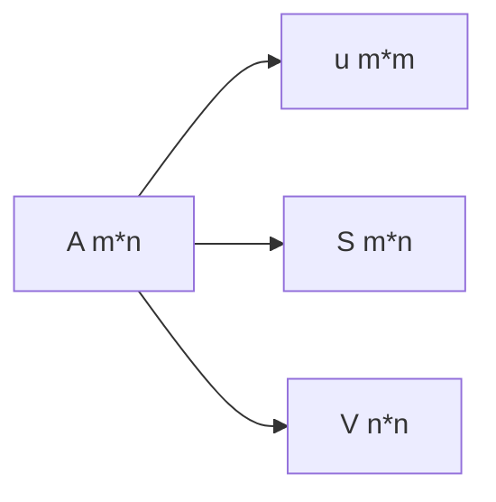

了解模糊、溶解等图形学基本操作
<!--more-->

# 图像处理笔记(一)常见操作

## 直方图均衡化

### 参考文档

[1] Jan Erik Solem. Python计算机视觉编程 (图灵程序设计丛书) (p. 11). 人民邮电出版社.

[2] 直方图均衡化

### 代码


```python
# 直方图均衡化
def histeq(im, nbr_bins = 256):
    """
    对一副灰度图像进行直方图均衡化
    """
    # 计算图像的直方图
    imhist, bins = histogram(im.flatten(), nbr_bins, normed = True)
    cdf = imhist.cumsum()
    cdf = 255 * cdf / cdf[-1]
    
    # 使用累积分布函数的线性插值，计算新的像素值
    im2 = interp(im.flatten(), bins[:-1], cdf)
    return im2.reshape(im.shape), cdf
```

### 讲解

#### 解决的问题


 通常，暗图像直方图的分量集中在灰度较低的一端，而亮图像直方图分量偏向于灰度较高的一端。

从图中可以得到这样的结论：如果一幅图像的灰度直方图几乎覆盖了整个灰度的取值范围，并且除了个别灰度值的个数较为突出，整个灰度值分布近似于均匀分布，那么这幅图像就具有较大的灰度动态范围和较高的对比度，同时图像的细节更为丰富。已经证明，仅仅依靠输入图像的直方图信息，就可以得到一个变换函数，利用该变换函数可以将输入图像达到上述效果，该过程就是直方图均衡化。

一句话说，就是直方图的值都聚在一块不清楚，均衡化之后能清除很多。

### 方法

将图像中的灰度级均匀的映射到整个灰度级范围，具体的方法如下：

* 前提假设：在一张有N个像素点的图片中，有灰度值的取值范围是0~M，你希望映射到的范围是$[x,y]$
* 第一步：统计每一个灰度值出现的次数$t_i$，其中$i$代表灰度，$t_i$代表其出现的次数
* 第二步：计算每一种灰度值对应的像素点个数在总体中占比$P_i = \frac{t_i}{N}$
* 第三步：计算累计占比$\sigma P_i=\Sigma_{i=0}^{i}P_i$
* 第四步：计算映射后的灰度值$final_i=\sigma P_i*(y-x+1)$ 

## 图像平均

### 代码

```python
def compute_average(imList):
    """
    计算图像列表的平均图像
    imList ： 一个列表，里面包含很多图像
    """
    # 打开一张图像，将其存放在浮点数类型数组中
    averageim = array(Image.open(imlist[0]), 'f')
    
    for imname in imlist[1:]:
        try:
            averageim += array(Image.open(imname))
        except:
            print(imname + '...skipped')
    averageim /= len(imlist)
    
    return array(averageim, 'uint8')

```

### 讲解

没啥好讲的，把一堆图拉到一块，平均一下即可。这个方法可以用于降噪， 但是我们也会发现，这个方法要把所有图片都拉到内存里，如果要平均很多的图片的话，我们需要拉很多的内存，不过又有一种方法就是可以每次平均一张也就是每次新引入一张，也可以。

## 图像的主成分分析（PCA）

### 参考资料

[1] Jan Erik Solem. Python计算机视觉编程 (图灵程序设计丛书) (p. 11). 人民邮电出版社.

[2] [机器学习经典算法：PCA降维与SVD矩阵分解]( https://www.bilibili.com/video/BV1F441187rd?from=search&seid=4973130116529586818 )—— [自兴人工智能教育](https://space.bilibili.com/410704854) 

主成分分析法，老朋友了。这个目前已知的有两种用法：

* 降低数据维度
* 求每一个值在总体中的客观权重（重要程度）

利用这个可以做图像的缩略图，它的优点是能在降维的时候，同时尽量多的保持训练数据的信息，这就很nb了。

### 代码

```python
# PCA
def pca(X):
    """
    主成分分析法：
    输入： 矩阵X，其中该矩阵中储存训练数据，每一行为一条训练数据
    返回：投影矩阵（按维度的重要性排序）、方差和均值
    """
    # 转化成numpy.array矩阵
    X = np.array(X)
    
    # 获取维度
    num_data, dim = X.shape
    
    # 数据中心化
    mean_X = X.mean(axis = 0)
    X = X - mean_X
    
    if(dim > num_data):
        # PCA - 使用紧致技巧
        M = dot(X,X.T) # 协方差矩阵
        e, EV = linalg.eigh(M) # 特征值和特征向量
        tmp = dot(X.T, EV).T #紧致技巧？？？说实话我还是不懂
        V = tmp[::-1]# 由于最后的特征向量是我们所需要的，所以要将它逆转
        S = sqrt(e)[::-1]# 由于特征值是按照递增顺序排列的，所以需要将其逆转
        for i in range(V.shape[1]):
            V[:, i] /= S
    else :
        # PCA- 使用SVD方法
        U, S, V = linalg.svd(X)
        V = V[:num_data] # 仅仅返回前num_data 维的数据才合理
        
    return V, S, mean_X
```

### 原理

#### PCA

##### PCA做了什么？

众所周知，PCA可以用来降维，举例来说，如果现在由一组数据，规格是100\*4的，也就是说，有100组数据，每组数据有4个特征，现在我们想把它的每一组特征的数目降到2，变化完成后，变成100\*2的矩阵，那么这个变化需要什么呢？学过线代的同学都懂了，这里需要在乘上个4\*2的矩阵就可以完成这种变化，那么求这个4\*2的矩阵，就是PCA的主要任务。

##### 操作流程

* 第一步：先对数据进行标准化操作

* 第二步：计算协方差矩阵

  什么是协方差：

  协方差：$\sigma_{jk}=\frac{1}{n-1}\Sigma_{i=1}^n(x_{ij}-x_{j}.mean)(x_{ik}-x_k.mean)$

  协方差代表着两个数据之间的相关性，相关性越大，协方差越大

  协方差矩阵蕴含着任意两个变量之间的协方差

  协方差矩阵的计算：$\Sigma=\frac{1}{n-1}((X-x.mean^T(X-x.mean))$

* 对协方差矩阵求特征值和特征向量：

  什么是特征值和特征向量?

  线性代数学了一年多了，现在只记得加减乘和转置了，取个逆都是高端操作了，特征值和特征向量是啥来着？不记得了。

  直接看定义：$A$ 是$n$阶方阵，若存在数$\lambda$和非零向量x使得$Ax = \lambda x$那么称$\lambda$是A的一个特征值，$x$为A的对应于特征值$\lambda$的特征向量。

  我们现在有一个这样的矩阵：
  $$
  a = \left[
  \begin{matrix}
  1 & 2&3&4\\
  2&1&5&6\\
  3&5&1&7\\
  4&6&7&1
  \end{matrix}
  \right]
  $$
  我们使用语句：np.linalg.eig(a)，得到了以下结果

  ```python
  In [9]: a = np.array([[1,2,3,4],[2,1,5,6],[3,5,1,7],[4,6,7,1]])
  In [10]: b,c = np.linalg.eig(a)
  In [11]: b, c
  Out[11]:
  (array([15.01698746, -0.67469831, -4.04123361, -6.30105553]),
   array([[ 0.35249192,  0.89949656, -0.21038586, -0.14964351],
          [ 0.49287878, -0.40507255, -0.72842863, -0.24975682],
          [ 0.54203206, -0.15251679,  0.63351659, -0.53065677],
          [ 0.58225527, -0.05967247,  0.15422794,  0.79600989]]))
  ```

  我们根据刚才的定义进行检验：

  ```python
  In [26]: b[0]*c[:,0]
  Out[26]: array([5.29336674, 7.40155453, 8.13968862, 8.74372006])
  In [27]: np.dot(a,c[:,0])
  Out[27]: array([5.29336674, 7.40155453, 8.13968862, 8.74372006])
  ```

  ```python
  In [28]: b[1]*c[:,1]
  Out[28]: array([-0.60688881,  0.27330177,  0.10290282,  0.04026092])
  
  In [29]: np.dot(a,c[:,1])
  Out[29]: array([-0.60688881,  0.27330177,  0.10290282,  0.04026092])
  ```

  所以我们得到了四组特征向量和特征值，据说特征值代表着当前特征向量的重要程度。

  对这些特征值进行归一化，将他们映射到1~100的区间中。


  可以看到，后两个特征值都太小了，而且我们的任务是把这个100\*4的矩阵转化成100\*2的矩阵，所以我们需要选取两个特征向量，所以呢我们就去选最大的两个特征值所对应的特征向量，也就是特征向量0和1。

  将他们合成一个4*2的矩阵，计算原矩阵与他们的矩阵乘法，就可以得到新的特征矩阵了。

#### SVD矩阵分裂

##### 目标

将一个矩阵A分解三个矩阵的乘积：

如下:



我们的目标是将一个m\*n的矩阵A拆分成u\*S\*V的形式，他们的形状如上图所示。

其中S是一个对角矩阵，对角矩阵就是只有主对角线上的元素不是零的矩阵，你还看不懂什么叫对角矩阵的话建议百度。

剩下的看这篇博客 https://mp.weixin.qq.com/s/Dv51K8JETakIKe5dPBAPVg 


## 使用pickle模块

pickle可以接受几乎所有python的对象，并且将其转换成字符串表示，这个过程叫做**封装(pickling)**。从字符串表示中重构该对象，成为**拆封(unpickling)**。这些字符串表示可以方便的储存和传输。

### 储存

```python
f = open('font_pca_modules.pkl', 'wb')
pickle.dump(immean,f)
pickle.dump(V,f)
f.close()
```

在上述的例子中，许多对象可以保存到同一文件中。pickle模块中有很多不同协议可以生成.pkl文件，如果不确定的话，最好以二进制文件的形式去读取、写入。在其他python会话中载入数据，只需要使用load()方法。

### 读取

```python
f = open('font_pca_modules.pkl', 'rb')
immean = pickle.load(f)
V = pickle.load(f)
f.close()
```

需要注意的是，dump的顺序和load的顺序必须一样，当然，与文件相关的读写操作可以用with语句完成，这样可以避免文件开关导致的错误。

### 使用with的保存和载入

#### 保存

```python
with open('font_pca_modules.pkl', 'wb') as f:
    pickle.dump(immean,f)
	pickle.dump(V,f)
```

#### 载入

```python
with open('font_pca_modules.pkl', 'rb') as f:
    immean = pickle.load(f)
	V = pickle.load(f)
```

从本质上说这两种方法没什么不同的，就是在with的作用域中，f是开的，出了with的作用域后，f就会自动关闭，当然我本人是不喜欢这种代码形式的，但是为了让自己的代码风格尽量规范，我决定适应这一形式。

## Scipy

### 图像模糊

作者在这里又不经意的抛出了一个重点。。

图像的**高斯模糊**的实质就是灰度图像I和一个高斯核进行卷积的操作。

这里给没有入门的兄弟萌讲一下，什么叫卷积，数学上两个函数的卷积，我目前还没有学（大二下）。图的卷积只是借了一个概念而已，简单地讲：假如有一个$n \times n$的矩阵A ，还有一个$3 \times3$的滤波器B。不要纠结什么叫滤波器，下面会讲清楚的。他们现在分别长这个样子：
$$
A = 
\left[
\begin{matrix}
a_{1,1} & a_{1,2} &... & a_{1,n} \\
a_{2,1} & a_{2,2} &... & a_{2,n} \\
...  &...& &... \\
a_{n,1} &a_{n,2}&... &a_{n,n}
\end{matrix}
\right],
B = 
\left[
\begin{matrix}
-1&0&1\\
-1&0&1\\
-1&0&1
\end{matrix}
\right]
$$
A和B进行卷积操作，生成了个什么玩意呢?很简单，生成了一个新的矩阵，这个矩阵的每一个元素就像是下面的图片里一样（特殊说明：下面的图片是我在[这个网站]( https://www.cnblogs.com/SivilTaram/p/graph_neural_network_2.html )上面直接拿的）


所以我们可以做一个联想，卷积就是拿着一个放大镜把这个图扫一遍生成一张新的图，放大镜(也就是滤波器)不一样，得到的结果也不一样。

下面我们来看一下如何对一张图片进行高斯模糊。talk is free，代码来了：

```python
from PIL import Image
from numpy import *
from scipy.ndimage import filters
def compare(im1, im2, module = 'gray'):
    """
    在一张图里面显示两个图片
    """
    fig, ax = plt.subplots(figsize=(12,8),ncols=2,nrows=1)
    ax[0].imshow(im1, module)
    ax[1].imshow(im2, module)
    plt.show()
    
im = array(Image.open("C:\\Users\\wangsy\\Desktop\\learning\\timg.jpg").convert("L"))
im2 = filters.gaussian_filter(im, 5)

compare(im, im2)
```

主体就只有下面两行，filters.gaussian_filter(im, 5)，这里的第一个参数代表需要进行高斯模糊的矩阵，第二个代表标准差，这个大家都懂，最后的效果如下:


我们将标准差从5降低到2进行观察，发现果然模糊的程度降低了。


如果要对一张彩色图像进行高斯模糊（彩色图形就是多通道图形，我们的灰度图只有一个通道，而通常彩色图形是由RGB三个通道组成的），我们只需要对他的每一层进行高斯模糊即可。

```python
from PIL import Image
from numpy import *
from scipy.ndimage import filters
def compare(im1, im2, module = 'gray'):
    """
    在一张图里面显示两个图片
    """
    fig, ax = plt.subplots(figsize=(12,8),ncols=2,nrows=1)
    ax[0].imshow(im1, module)
    ax[1].imshow(im2, module)
    plt.show()
    
im = array(Image.open("C:\\Users\\wangsy\\Desktop\\learning\\timg.jpg"))
im2 = zeros(im.shape)
for i in range(3):
    im2[:, :, i] = filters.gaussian_filter(im[:, :, i], 5)
im2 = uint8(im2)
compare(im, im2)
```

效果如下：


将标准差降低到2，效果如下


对于三通道，我产生了一种很奇葩的想法， 那就是如果每一层用于模糊的标准差不一样会发生什么？我将模糊的值从全都是五改为了i*3：

```python
im2[:, :, i] = filters.gaussian_filter(im[:, :, i], i*3)
```

模糊后的图片变成了这样：


我们可以理解，因为图像中的红色被模糊的较少，比较强烈，而蓝色和绿色被模糊的程度较大，无法保持原来的亚子，所以红色的框架被显现出来。

将模糊值调节到i*20，我们会发现， 这变成了一张具有魔幻现实主义的图片😂


### 图像导数

##### 参考资料

[1] [边缘检测的各种微分算子比较](https://www.cnblogs.com/molakejin/p/5683372.html)

从书中可以看出来，在很多应用中图像强度的变化情况是非常重要的信息。强度的变化可以用灰度图像$I$的$x$和$y$方向导数$I_x$和$I_y$进行描述。

梯度之中包含两个信息：

* **梯度的大小**：

  $|\Delta I| = \sqrt{I_x^2 + I_y^2}$

  他描述了图像变化的强弱

* **梯度的角度**：

  $\alpha = arctan2(I_y,I_x)$

  描述了图像中在每一个点上强度变化的最大方向。

我们可以使用离散点近似的方式来计算图像的导数。图像的导数可以通过卷积简单地实现：
$$
I_x = I * D_x ,I_y = I*D_y
$$
对于$D_x$和$D_y$，通常选择 Prewitt 滤波器：
$$
D_x = \left[
\begin{matrix}
-1&0&1\\
-1&0&1\\
-1&0&1
\end{matrix}
\right],
D_y = \left[
\begin{matrix}
-1&-1&-1\\
0&0&0\\
1&1&1
\end{matrix}
\right]
$$
或者是 Sobel 滤波器：
$$
D_x = \left[
\begin{matrix}
-1&0&1\\
-2&0&2\\
-1&0&1
\end{matrix}
\right],
D_y = \left[
\begin{matrix}
-1&-2&-1\\
0&0&0\\
1&2&1
\end{matrix}
\right]
$$


如果你看懂了上一节像关于**什么是滤波器**的问题的话，这里应该不难理解，如果你没看懂，那大概率是我没有讲清楚，你可以去网上搜集一些视频教程或是博客帮助自己理解。这两种滤波器的区别是： 据经验得知Sobel要比Prewitt更能准确检测图像边缘。 

下面看一下效果:

```python
from PIL import Image
from numpy import *
from scipy.ndimage import filters

def compare(im1, im2, module = 'gray'):
    """
    在一张图里面显示两个图片
    """
    fig, ax = plt.subplots(figsize=(12,8),ncols=2,nrows=1)
    ax[0].imshow(im1, module)
    ax[1].imshow(im2, module)
    plt.show()
    
    
im = array(Image.open("C:\\Users\\wangsy\\Desktop\\learning\\timg.jpg").convert("L"))

# Sobel
imx = zeros(im.shape)
filters.sobel(im,1,imx)

imy = zeros(im.shape)
filters.sobel(im,0,imy)

magnitude = sqrt(imx**2 + imy**2)
compare(im, magnitude)
```


上面展示的是最后提取的X轴和Y轴综合的梯度图


上面两张分别是X轴和Y轴检测的。

今天先到这里。