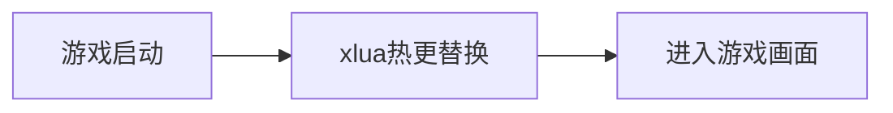

XLua 实现了 unity 中 c# 脚本与 lua 脚本之间的互调功能，并且提供了热更的能力，这篇文章学习 XLua 的使用
<!--more-->

# 一、 hello world


## 1. 创建工程并导入 XLua


下载`Xlua`: [xlua链接](https://github.com/Tencent/xLua)


**创建一个全新的unity工程**，这里我使用的unity版本是`2021.3.33f1c1`。

- 创建结束后，将`XLua`中的`Assets/Plugins`, `Assets/XLua`, `Tools`, `WebGLPlugins`目录依次拷贝到我们新建的项目中。

- 随后将`Assets/XLua/Examples`, `Assets/XLua/Tutorial`下的代码删除（不然会有一些莫名其妙的bug）。


<center>
    
    <p>
        <b>图1：将XLua导入到已有工程</b>
    </p>
</center>


**使用XLua生成代码**

点击`XLua > Generate Code`， 能够观察到`Assets/XLua/Gen`下生成了一些代码：

<center>
    
    <p>
        <b>图2：使用 XLua Generate Code</b>
    </p>
</center>


## 2. 通过XLua运行简单脚本

创建`TestMain`脚本，写入如下内容：

```c#
using UnityEngine;
using XLua;

public class TestMain : MonoBehaviour
{
        void Start()
        {
            LuaEnv luaenv = new LuaEnv();
            luaenv.DoString("CS.UnityEngine.Debug.Log('hello world')");
            luaenv.Dispose();

            Debug.Log("Unity C#: hello world");
        }
}

```


## 3. 编译并运行项目

直接`File > Build And Run`，编译出来`webgl`项目，项目运行后，能够在控制台中分别看到来自`luaenv.DoString`和`Debug.Log`的输出：

<center>
    
    <p>
        <b>图3：运行 hello world</b>
    </p>
</center>


## 可能踩到的坑

在这个过程里面还是有一些坑的，我遇到了两个坑：

### a) 提示 'Light' does not contain a definition for 'shadowAngle'

<center>
    
    <p>
        <b>图4：未删除 Examples 导致的错误</b>
    </p>
</center>


如上图所示，可能是因为没有删除`Examples`导致的问题，直接将`Assets/XLua/Examples`删除并重新`Generate Code`后再编译即可解决。


### b) 提示 xlua_webgl.cpp错误

<center>
    
    <p>
        <b>图5：xlua_webgl.cpp错误</b>
    </p>
</center>

点开后查看详情，看到：

> In file included from Assets/Plugins/WebGL/xlua_webgl.cpp:35:
> WebGLPlugins\i64lib.c:409:34: error: invalid suffix on literal; C++11 requires a space between literal and identifier [-Wreserved-user-defined-literal]
>         snprintf(temp, sizeof(temp), "%"PRIu64, n);

其中：

```c
# if __WORDSIZE == 64  
#  define PRIu64    "lu"   
# else  
#  define PRIu64    "llu"  
```

`c++11`里面，两个字符串拼在一起的时候，中间要插入空格，我们在`"%"PRIu64`中间插入空格，变为`"%" PRIu64`就可以了。


### c) macos 提示 DLLNotFound

> DllNotFoundException: xlua assembly:<unknown assembly> type:<unknown type> member:(null)
> XLua.LuaEnv..ctor () (at Assets/XLua/Src/LuaEnv.cs:66)
> CSObjectWrapEditor.Generator..cctor () (at Assets/XLua/Src/Editor/Generator.cs:109)
> Rethrow as TypeInitializationException: The type initializer for 'CSObjectWrapEditor.Generator' threw an exception.

https://github.com/Tencent/xLua/issues/986 这个issue中有人反馈类似的问题，我们需要对`xlua`进行重新编译。


进入`XLua`下的目录: `xLua/build`，执行`./make_osx_lua53.sh`

编译出来新的`xlua.bundle`后，替换项目下的`Assets/Plugins/xlua.bundle`

重新打开unity工程即可解决问题。


# 二、使用Lua脚本代替 MonoBehavior


## 1. 导入 LuaBehaviour.cs 

将`XLua`的`Examples`中的`LuaBehaviour.cs`导入项目：

```c#
using UnityEngine;
using System.Collections;
using System.Collections.Generic;
using XLua;
using System;

[System.Serializable]
public class Injection
{
    public string name;
    public GameObject value;
}

[LuaCallCSharp]
public class LuaBehaviour : MonoBehaviour
{
    public TextAsset luaScript;
    public Injection[] injections;

    internal static LuaEnv luaEnv = new LuaEnv(); //all lua behaviour shared one luaenv only!
    internal static float lastGCTime = 0;
    internal const float GCInterval = 1;//1 second 

    private Action luaStart;
    private Action luaUpdate;
    private Action luaOnDestroy;

    private LuaTable scriptEnv;

    void Awake()
    {
        scriptEnv = luaEnv.NewTable();

        // 为每个脚本设置一个独立的环境，可一定程度上防止脚本间全局变量、函数冲突
        LuaTable meta = luaEnv.NewTable();
        meta.Set("__index", luaEnv.Global);
        scriptEnv.SetMetaTable(meta);
        meta.Dispose();

        scriptEnv.Set("self", this);
        foreach (var injection in injections)
        {
            scriptEnv.Set(injection.name, injection.value);
        }

        luaEnv.DoString(luaScript.text, "LuaTestScript", scriptEnv);

        Action luaAwake = scriptEnv.Get<Action>("awake");
        scriptEnv.Get("start", out luaStart);
        scriptEnv.Get("update", out luaUpdate);
        scriptEnv.Get("ondestroy", out luaOnDestroy);

        if (luaAwake != null)
        {
            luaAwake();
        }
    }

    // Use this for initialization
    void Start()
    {
        if (luaStart != null)
        {
            luaStart();
        }
    }

    // Update is called once per frame
    void Update()
    {
        if (luaUpdate != null)
        {
            luaUpdate();
        }
        if (Time.time - LuaBehaviour.lastGCTime > GCInterval)
        {
            luaEnv.Tick();
            LuaBehaviour.lastGCTime = Time.time;
        }
    }

    void OnDestroy()
    {
        if (luaOnDestroy != null)
        {
            luaOnDestroy();
        }
        luaOnDestroy = null;
        luaUpdate = null;
        luaStart = null;
        scriptEnv.Dispose();
        injections = null;
    }
}
```


这里：

- 创建了`lua`虚拟机
- 将`this`当前的这个`gameobject`作为`self`注入到脚本中
- 如果想要注入其他的`gameobject`，可以通过`Injection`配置项进行配置
- 通过`DoString`执行`lua`，随后获取`start`, `update`, `ondestroy`, `awake`函数，并且在相应的时机进行调用


## 2. 创建lua脚本，并且进行绑定

创建`AlwaysPrintLog.lua.txt`

```lua
function awake()
	print("lua start...")
end

function start()
	print("lua start...")
end

function update()
    print("lua: current object is ", self.gameObject.name)
end

function ondestroy()
    print("lua destroy")
end
```


将我们的`LuaBehaviour`绑定到`Main Camera`上，然后将刚才写的`Lua`脚本帮上来：

<center>
    
    <p>
        <b>图6：绑定lua脚本</b>
    </p>
</center>


## 3. 编译运行

老样子，我们直接编译运行即可：


<center>
    
    <p>
        <b>图7：lua behaviour 运行结果</b>
    </p>
</center>


## 可能踩到的坑


### a) lua 执行时找不到 this 下的变量 (attempt to index a nil value)

<center>
    
    <p>
        <b>图8： lua 执行时找不到 this 下的变量 </b>
    </p>
</center>

具体的过程我贴到[github]()https://github.com/Tencent/xLua/issues/1129中，简单来说，你需要：

1. 将`Example/ExampleGenConfig.cs`复制到项目下
2. 修改`UNITY_ANDROID`的宏定义为`UNITY_ANDROID || UNITY_WEBGL`

```c#
 //黑名单
    [BlackList]
    public static List<List<string>> BlackList = new List<List<string>>()  {
                new List<string>(){"System.Xml.XmlNodeList", "ItemOf"},
                new List<string>(){"UnityEngine.WWW", "movie"},
    #if UNITY_WEBGL
                new List<string>(){"UnityEngine.WWW", "threadPriority"},
    #endif
                new List<string>(){"UnityEngine.Texture2D", "alphaIsTransparency"},
                new List<string>(){"UnityEngine.Security", "GetChainOfTrustValue"},
                new List<string>(){"UnityEngine.CanvasRenderer", "onRequestRebuild"},
                new List<string>(){"UnityEngine.Light", "areaSize"},
                new List<string>(){"UnityEngine.Light", "lightmapBakeType"},
    #if UNITY_ANDROID || UNITY_WEBGL
                new List<string>(){"UnityEngine.Light", "SetLightDirty"},
                new List<string>(){"UnityEngine.Light", "shadowRadius"},
                new List<string>(){"UnityEngine.Light", "shadowAngle"},
    #endif
                new List<string>(){"UnityEngine.WWW", "MovieTexture"},
                new List<string>(){"UnityEngine.WWW", "GetMovieTexture"},
                new List<string>(){"UnityEngine.AnimatorOverrideController", "PerformOverrideClipListCleanup"},
    #if !UNITY_WEBPLAYER
                new List<string>(){"UnityEngine.Application", "ExternalEval"},
    #endif
                new List<string>(){"UnityEngine.GameObject", "networkView"}, //4.6.2 not support
                new List<string>(){"UnityEngine.Component", "networkView"},  //4.6.2 not support
                new List<string>(){"System.IO.FileInfo", "GetAccessControl", "System.Security.AccessControl.AccessControlSections"},
                new List<string>(){"System.IO.FileInfo", "SetAccessControl", "System.Security.AccessControl.FileSecurity"},
                new List<string>(){"System.IO.DirectoryInfo", "GetAccessControl", "System.Security.AccessControl.AccessControlSections"},
                new List<string>(){"System.IO.DirectoryInfo", "SetAccessControl", "System.Security.AccessControl.DirectorySecurity"},
                new List<string>(){"System.IO.DirectoryInfo", "CreateSubdirectory", "System.String", "System.Security.AccessControl.DirectorySecurity"},
                new List<string>(){"System.IO.DirectoryInfo", "Create", "System.Security.AccessControl.DirectorySecurity"},
                new List<string>(){"UnityEngine.MonoBehaviour", "runInEditMode"},
            };
```


即可正常运行。


# 三、使用 lua 实现 c# 接口

上一小节中，我们使用`Lua`实现了一个`MonoBehavior`，实际开发中可能遇到的需求是：存在一个通用的抽象接口，希望能够加载不同的实现。这里不同的实现，希望实现在`Lua`中。这一小节，我们看看怎么样用`Lua`实现一个`C#`的接口。


## 1. 希望被实现的接口

假如我们想实现一个输入框，用户每次输入内容后，可以点击按钮，我们的程序根据用户不同的输入，进入到不同的逻辑中进行处理。

其逻辑如下（硬写的话）：

```c#
using TMPro;
using UnityEngine;

public class UIDemoButtonClickHandler : MonoBehaviour
{
    public TMP_Text inputText;

    public void OnClick()
    {
        string rawInputText = inputText.text;
        if (rawInputText.Contains("fuck"))
        {
            Debug.Log($"user text: {rawInputText}, do not speak dirty word");
        }
        else
        {
            Debug.Log($"user text: {rawInputText}");
        }
    }
}
```


<center>
    
    <p>
        <b>图9： 根据不同的文本进入不同的逻辑 </b>
    </p>
</center>


## 2. 尝试用lua让它变得更好

上面这样的写法会遇到的问题是：每次维护都需要修改`c#`脚本并且重新编译，很麻烦

我们可以开一个可配置的脚本，往里面配`stopword`和对应的脚本：

```c#
using System;
using System.Collections.Generic;
using TMPro;
using UnityEngine;
using XLua;

[Serializable]
public class LuaHandlerItem
{
    // 遇到这个词的时候, 走当前lua脚本进行处理.
    public string stopWord;

    // 使用这个脚本进行处理.
    public TextAsset luaScript;
}

public class UIDemoButtonClickHandler : MonoBehaviour
{
    public TMP_Text inputText;

    public List<LuaHandlerItem> luaHandlers;

    public TextAsset defaultHandler;


    internal static LuaEnv luaEnv = new LuaEnv(); //all lua behaviour shared one luaenv only!

    [CSharpCallLua]
    delegate void HandleTextFunc(string text);

    public void OnClick()
    {
        foreach (LuaHandlerItem tryToUseHandler in luaHandlers)
        {
            if (!inputText.text.Contains(tryToUseHandler.stopWord))
            {
                continue;
            }


            ExecLuaHandleFunc(tryToUseHandler.luaScript);
            return;
        }

        // 没找到.
        ExecLuaHandleFunc(defaultHandler);
    }

    private void ExecLuaHandleFunc(TextAsset luaHandler)
    {
        LuaTable scriptEnv = luaEnv.NewTable();

        LuaTable meta = luaEnv.NewTable();
        meta.Set("__index", luaEnv.Global);
        scriptEnv.SetMetaTable(meta);
        meta.Dispose();

        luaEnv.DoString(luaHandler.text, "UIDemoTextHandler", scriptEnv);


        var handleFunc = scriptEnv.Get<HandleTextFunc>("handleText");
        handleFunc(inputText.text);

        return;
    }
}
```


这个脚本中，我们定义了一个可以配置的`List`，`List`中每一个Item代表一个配置项，配置适用的`stopword`和对应的脚本，如果找到了对应的`stopword`，就执行其脚本。

获取到脚本后，我们定义了一个名为`HandleTextFunc`的委托（类似于函数指针），从`lua`中通过函数名将这个委托取出，进行调用即可。

我们为此开发了三个脚本：

**default**

```lua
function handleText(text)
    print("lua handle text"..text)
end
```

**fuck**

```lua
function handleText(text)
    print("do not speak dirty words")
end
```

**shit**

```lua
function handleText(text)
    print("shit is not a good word")
end
```


接下来在页面上进行绑定：

<center>
    
    <p>
        <b>图10： 配置stopword到lua脚本的映射关系</b>
    </p>
</center>

绑定完成后，我们编译并且运行即可：

<center>
    
    <p>
        <b>图11： 函数式调用结果</b>
    </p>
</center>


## 3. 给脚本系统加上oop

上面的程序能够完成功能，但是不够优雅，我们可以给他搞上oop

**首先定义好接口 & CreateFunc**

```c#
[CSharpCallLua]
public interface LuaTextHandler
{
    string HandleText(string text);
}

[CSharpCallLua]
public delegate LuaTextHandler CreateTextHandlerFunc();
```


**实现读取 & 调用**

```c#
private void ExecLuaHandleFunc(TextAsset luaHandler)
{
    LuaTable scriptEnv = luaEnv.NewTable();

    LuaTable meta = luaEnv.NewTable();
    meta.Set("__index", luaEnv.Global);
    scriptEnv.SetMetaTable(meta);
    meta.Dispose();

    luaEnv.DoString(luaHandler.text, "UIDemoTextHandler", scriptEnv);


    CreateTextHandlerFunc createHandlerFunc = scriptEnv.Get<CreateTextHandlerFunc>("CreateTextHandlerFunc");
    LuaTextHandler handler = createHandlerFunc();

    Debug.Log(handler.HandleText(inputText.text));

    return;
}
```


**编写lua脚本**

```lua
local text_handler_mt = {
    __index = {
        HandleText = function(self, text)
            return "lua handle text"..text
        end
    }
}

function CreateTextHandlerFunc()
    return setmetatable({}, text_handler_mt)
end
```


```lua
local text_handler_mt = {
    __index = {
        HandleText = function(self, text)
            return "do not speak dirty words"
        end
    }
}

function CreateTextHandlerFunc()
    return setmetatable({}, text_handler_mt)
end
```


```lua
local text_handler_mt = {
    __index = {
        HandleText = function(self, text)
            return "shit is not a good word"
        end
    }
}

function CreateTextHandlerFunc()
    return setmetatable({}, text_handler_mt)
end
```


**接下来运行即可**

<center>
    
    <p>
        <b>图11： oop调用结果</b>
    </p>
</center>


# 四、热更新

回顾第三节中提到的case，我们发现这种使用lua的方式必须预设好在什么地方使用lua才行，但是实际在开发过程中，我们的需求变化的非常迅速，很难预判的这么精准，这时候就可以使用热更新的方案。 这一节中我们进一步完善这个case，利用xlua提供的功能，使用lua直接替代原有的c#代码。


## 1. 打开HOTFIX特性

打开`Player Settings > Other Settings`，找到里面的`Script Compliation / Scripting Define Symbols` 选项，添加`HOTFIX_ENABLE`选项，点击`Apply`

<center>
    
    <p>
        <b>图12： 打开 HOTFIX_ENABLE 编译选项</b>
    </p>
</center>

接下来等待`Editor`部分重新编译后，点开`XLua`栏，发现`Hotfix Inject in Editor`选项出现，说明开启成功。


## 2. 添加检查更新流程



接下来我们在代码中实现上述流程，在游戏启动`Awake`过程中，我们植入可热更的`lua`脚本，对原有的`	c#`代码部分进行替换：


### a. 将原有逻辑部分标记为可热更

```c#
[Hotfix]
public class UIDemoButtonClickHandler : MonoBehaviour
{
    ... 中间部分没有变化，直接省略掉了 
}
```

在原来的`UIDemoButtonClickHandler`类上，加上`Hotfix`的标签。


### b. 添加xlua热更替换流程

我们在场景中添加一个空`GameObject`，在其中绑定一个`GameObjet`，在`GameObject`上绑定脚本：

```c#
using UnityEngine;
using XLua;

public class CheckXluaHotfixOnGameAwake : MonoBehaviour
{
    LuaEnv luaenv = new LuaEnv();

    public TextAsset makeHotfixLuaScript;

    // Awake 在游戏启动阶段对部分逻辑进行hotfix替换.
    void Awake()
    {
        if (makeHotfixLuaScript != null)
        {
            luaenv.DoString(makeHotfixLuaScript.text);
        }
    }
}
```


接下来编写`lua`脚本对`UIDemoButtonClickHandler`中的逻辑进行替换：

```lua
xlua.hotfix(CS.UIDemoButtonClickHandler, 'OnClick', function(self)
    print("lua: no check for text: " .. self.inputText.text)
end)
```


## 3. 重新使用 xlua 生成代码 并注入

<center>
    
    <p>
        <b>图13： 使用xlua重新生成代码</b>
    </p>
</center>

重新`GenerateCode`, `Hotfix Inject in Editor`即可：

<center>
    
    <p>
        <b>图14：inject 成功图示</b>
    </p>
</center>

看到上图所示日志就说明成功。


## 4. 编译运行

直接运行代码，可以观察到原有逻辑已经被替换：

<center>
    
    <p>
        <b>图15：被替换后的程序表现</b>
    </p>
</center>
